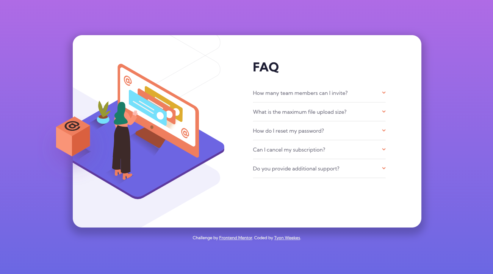

# Frontend Mentor - FAQ accordion card solution

This is a solution to the [FAQ accordion card challenge on Frontend Mentor](https://www.frontendmentor.io/challenges/faq-accordion-card-XlyjD0Oam). Frontend Mentor challenges help you improve your coding skills by building realistic projects. 

## Table of contents

- [Overview](#overview)
  - [The challenge](#the-challenge)
  - [Screenshot](#screenshot)
  - [Links](#links)
- [My process](#my-process)
  - [Built with](#built-with)
  - [What I learned](#what-i-learned)
  - [Continued development](#continued-development)
- [Author](#author)
- [Acknowledgments](#acknowledgments)

## Overview

### The challenge

Users should be able to:

- View the optimal layout for the component depending on their device's screen size
- See hover states for all interactive elements on the page
- Hide/Show the answer to a question when the question is clicked

### Screenshot

### Links

- Solution URL: [FAQ Accordion Card](https://tourmaline-sorbet-a85096.netlify.app)

## My process

### Built with

- Semantic HTML5 markup
- CSS custom properties
- Flexbox
- CSS Grid
- JavaScript

### What I learned

I learned how to add a background image inside a container and have it clipped inside the shape. I was able to use what I learned from an JavaScript accordion tutorial on FreeCodeCamp and put it into practice here. The layout overall was a challenge, but I learned a lot from Wayne Tasaki's solution (link below), especially with the image on the left.

### Continued development

More JavaScript, as well as CSS transitions.

## Author

- Website - [Tyon Weekes](https://www.tyonweekes.com)

## Acknowledgments

Wayne Tasaki's solution. [Wayne's Solution](https://github.com/WayneTasaki/faq-accordion-card)

